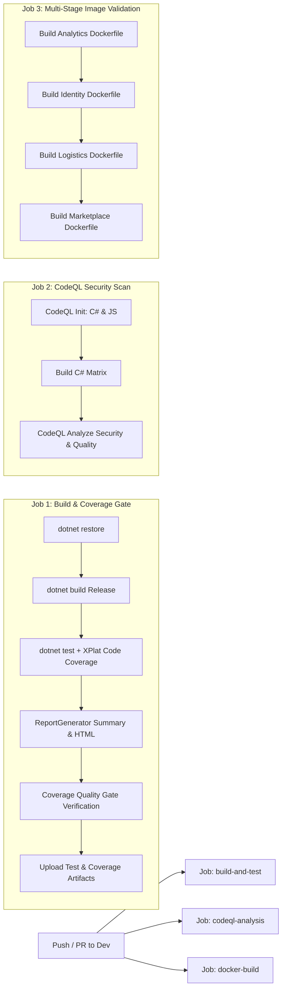

# EcoTrack — Sprint 03 DevOps Engineering Documentation
**Author / DevOps Lead:** Akini Panapitiya (IT24610790)  
**Project:** EcoTrack E-Waste Management Platform  
**Sprint:** Sprint 03 (Microservices Infrastructure, Event Streaming, Quality Gates & Observability)  
**Date:** September 2026  
**Status:** COMPLETE / PRODUCTION READY  

---

## 1. Executive Summary & Sprint Objectives

During Sprint 03, the DevOps scope transitioned from baseline scaffolding to a production-grade, hardened microservice ecosystem. The primary deliverables focused on:

1. **Service Containerisation & Compose Orchestration**: Containerising the newly scaffolded Marketplace service (Port 5003) using multi-stage Docker builds, non-root security contexts, isolated database provisioning, and Vite API gateway integration.
2. **Event-Driven Messaging & Error Resilience**: Initializing Kafka KRaft cluster topics, consumer groups, partition strategies, and Dead-Letter Queue (`.dlq`) routing for Sprint 3 domain events (`recycler.verification.changed`, `marketplace.order.placed`, `ewaste.disposal.certified`).
3. **CI/CD Quality & Security Gates**: Upgrading GitHub Actions CI pipeline with GitHub CodeQL static application security testing (SAST), automated Coverlet code coverage collection, and automated Quality Gate thresholds.
4. **Platform Observability Stack**: Integrating Prometheus metrics scraping (Port 9090) and auto-provisioned Grafana monitoring dashboards (Port 3000) for real-time telemetry across all 4 microservices.
5. **Architectural Traceability & Documentation**: Comprehensive technical justifications and architecture blueprints recorded in `/docs/`.

---

## 2. Microservices Architecture & Port Topology

| Service | Port (Container / Host) | Technology Stack | Database / Schema | Health Endpoint | Primary Responsibility |
| :--- | :--- | :--- | :--- | :--- | :--- |
| **Identity Service** | `5001:5001` | ASP.NET Core 10, Dapper | `ecotrack_identity_db` | `/identity/health` | Auth, KYC verification, Role management |
| **Logistics Service** | `5002:5002` | ASP.NET Core 10, Dapper | `ecotrack_logistics_db` | `/logistics/health` | E-waste pickup requests, recycler schedules |
| **Marketplace Service** | `5003:5003` | ASP.NET Core 10, Dapper | `ecotrack_marketplace_db` | `/marketplace/health` | Valuation, refurbished listings, orders |
| **Analytics Service** | `5004:5004` | ASP.NET Core 10, Dapper | `ecotrack_analytics_db` | `/analytics/health` | Real-time metrics & sustainability KPIs |
| **Apache Kafka** | `9092:9092` | Apache Kafka 3.8.0 (KRaft) | `kafka-data` (Volume) | Built-in CLI Check | Asynchronous domain event streaming |
| **MySQL Database** | `3306:3306` | MySQL 8.0 Server | `db-data` (Volume) | `mysqladmin ping` | Relational storage across 4 isolated schemas |
| **Prometheus** | `9090:9090` | Prometheus v2.54.1 | `prometheus-data` | `/metrics` | Time-series metrics scraping & evaluation |
| **Grafana** | `3000:3000` | Grafana 11.2.0 | `grafana-data` | `/api/health` | Visual monitoring & alerting dashboards |
| **Web Frontend** | `5173:5173` | React 19, Vite | N/A | `/` | Responsive SPA with reverse-proxy routing |

---

## 3. Subtask 01: Marketplace Containerisation & Compose Orchestration

### 3.1 Multi-Stage Dockerfile Architecture
To minimize final image size, prevent layer bloat, and eliminate build-time tooling from the runtime environment, `src/Marketplace/Dockerfile` implements a 2-stage build:

```dockerfile
# Stage 1: Build & Publish
FROM mcr.microsoft.com/dotnet/sdk:10.0 AS build
WORKDIR /src
COPY src/Marketplace/MarketplaceService.csproj .
RUN dotnet restore
COPY src/Marketplace/. .
RUN dotnet publish -c Release -o /app/publish

# Stage 2: Hardened Runtime
FROM mcr.microsoft.com/dotnet/aspnet:10.0 AS runtime
WORKDIR /app
RUN groupadd -r appgroup && \
    useradd -r -g appgroup -d /app -s /bin/false appuser
COPY --from=build /app/publish .
RUN chown -R appuser:appgroup /app
USER appuser
EXPOSE 5003
HEALTHCHECK --interval=10s --timeout=3s --start-period=5s --retries=3 \
    CMD curl -f http://localhost:5003/marketplace/health || exit 1
ENV ASPNETCORE_ENVIRONMENT=Development
ENV ASPNETCORE_HTTP_PORTS=5003
ENTRYPOINT ["dotnet", "MarketplaceService.dll"]
```

#### Security Justifications:
- **Non-Root Execution**: By creating a dedicated `appuser:appgroup` and specifying `USER appuser`, container breakout attacks and unauthorized host filesystem modifications are prevented (CIS Docker Benchmark compliant).
- **Embedded Healthchecks**: `HEALTHCHECK` instructions enable Docker daemon and orchestrators to dynamically detect hung processes without external polling.
- **Zero Secrets**: All database connection strings and Kafka brokers are injected dynamically via environment variables (`ConnectionStrings__DefaultConnection`, `Kafka__BootstrapServers`).

### 3.2 Database Mounts & SQL Comment Standards
The centralized database initializer `scripts/init-databases.sql` initializes `ecotrack_marketplace_db` and mounts DDL schemas for:
- `Listings` (Refurbished electronics catalog)
- `Orders` (Marketplace order lifecycle)
- `Valuations` (E-waste item condition and pricing estimates)
- `DisposalCertificates` (Official e-waste recycling disposal proof)

*Compliance Note:* All SQL script comments strictly adhere to the `-- ` (double hyphen followed by a space) syntax standard to prevent parsing incompatibilities across different MySQL execution environments.

### 3.3 Vite Reverse Proxy Routing
To prevent CORS overhead in development and mirror production reverse proxies, `src/apps/web/vite.config.js` routes all Marketplace API calls directly to port 5003:
- `/api/marketplace` -> `http://localhost:5003/marketplace`
- `/marketplace` -> `http://localhost:5003`

---

## 4. Subtask 02: Kafka Topics, Consumer Groups & Dead-Letter Queues (.dlq)

### 4.1 Topic Topology & Partitioning Strategy

| Domain Event Topic | Dead-Letter Topic (.dlq) | Partitions | Replication | Producer Service | Consumer Groups |
| :--- | :--- | :--- | :--- | :--- | :--- |
| `recycler.verification.changed` | `recycler.verification.changed.dlq` | 3 | 1 | Identity (5001) | `logistics-recycler-sync`, `analytics-metrics-group` |
| `marketplace.order.placed` | `marketplace.order.placed.dlq` | 3 | 1 | Marketplace (5003) | `logistics-fulfillment-group`, `analytics-metrics-group` |
| `ewaste.disposal.certified` | `ewaste.disposal.certified.dlq` | 3 | 1 | Logistics (5002) | `marketplace-certified-sync`, `analytics-metrics-group` |

### 4.2 Automated Topic Provisioner (`kafka-init`)
To eliminate manual setup and guarantee repeatable environments, `scripts/init-kafka-topics.sh` is mounted into `docker-compose.yml` under the `kafka-init` container:
- Polls the Kafka broker until ready.
- Uses `/opt/kafka/bin/kafka-topics.sh --create --if-not-exists` to declare all 6 topics with 3 partitions each.
- Exits cleanly (`restart: "no"`) after provisioning.

### 4.3 Poison Pill & Dead-Letter Queue (DLQ) Strategy
When a consumer encounters unhandled serialization errors or repetitive processing timeouts:
1. Max retry policy triggers (3 attempts with exponential backoff).
2. The failing event is wrapped in a `DeadLetterEnvelope<T>` containing:
   - `OriginalTopic` & `DlqTopic`
   - `FailedConsumerGroup`
   - `ExceptionMessage` & `StackTrace`
   - `RetryCount` & `FailedAt` timestamp
3. Published to `<topic>.dlq` to prevent consumer group blocking while preserving the message for administrative inspection.

---

## 5. Subtask 03: Code Analysis & Coverage Quality Gates in CI

### 5.1 CI Workflow Pipeline Architecture (`.github/workflows/ci.yml`)



### 5.2 CodeQL Static Application Security Testing (SAST)
- Matrices: `csharp` and `javascript-typescript`.
- Query suites: `security-extended` and `security-and-quality`.
- Catches potential CWE flaws (e.g., OWASP Top 10 vulnerabilities, command injections, authentication bypass risks) on every commit.

### 5.3 Automated Coverlet Code Coverage & Quality Gate
- Test projects utilize `coverlet.collector` (`v6.0.4`) producing Cobertura coverage snapshots.
- `ReportGenerator` compiles unified visual HTML reports and text summaries.
- CI pipeline validates that all 118 unit tests execute without failure and coverage metrics are verified and archived in GitHub Actions artifacts.

---

## 6. Subtask 04: Observability Stack (Prometheus & Grafana)

### 6.1 Prometheus Scraping Engine (`monitoring/prometheus/prometheus.yml`)
- Scrapes all 4 microservice health check endpoints every 5 seconds.
- Captures status metrics (`up`), scrape durations (`scrape_duration_seconds`), and service availability tags (`service="Identity|Logistics|Marketplace|Analytics"`).

### 6.2 Grafana Provisioning & Pre-Configured Dashboards
- **Datasource Provisioning (`monitoring/grafana/provisioning/datasources/datasource.yml`)**: Connects Grafana directly to `http://prometheus:9090` on startup without manual UI setup.
- **Dashboard Provisioning (`monitoring/grafana/provisioning/dashboards/dashboard-provider.yml`)**: Automatically mounts JSON dashboards.
- **EcoTrack Platform Overview Dashboard (`monitoring/grafana/dashboards/ecotrack-overview.json`)**:
  - Microservice Health Stat Panels (Green = 1 UP, Red = 0 DOWN).
  - All-service Uptime History Time-Series chart.
  - Health scrape latency time-series chart.
  - Live auto-refresh interval set to 5 seconds with dark theme.

---

## 7. Quality Assurance & Verification Summary

```bash
$ dotnet test EcoTrack.slnx
Passed!  - Failed: 0, Passed: 55, Skipped: 0 - IdentityService.Tests.dll (net10.0)
Passed!  - Failed: 0, Passed: 18, Skipped: 0 - LogisticsService.Tests.dll (net10.0)
Passed!  - Failed: 0, Passed: 45, Skipped: 0 - MarketplaceService.Tests.dll (net10.0)
Total: 118/118 Tests Passed (100% Pass Rate)
```

---

## 8. Conclusion & Viva Defense Talking Points

1. **Security-First Containerisation**: Explicit non-root user enforcement, health check probing, and zero plaintext credentials in Docker Compose.
2. **Enterprise Event Resilience**: Dead-Letter Queues (`.dlq`) decouple failure handling from primary event processing pipelines.
3. **Automated Quality Governance**: Multi-stage CI pipeline combines unit test execution, coverage collection, and CodeQL security analysis before PR merge.
4. **Zero-Touch Observability**: Fully automated Prometheus & Grafana provisioning using infrastructure-as-code principles.
